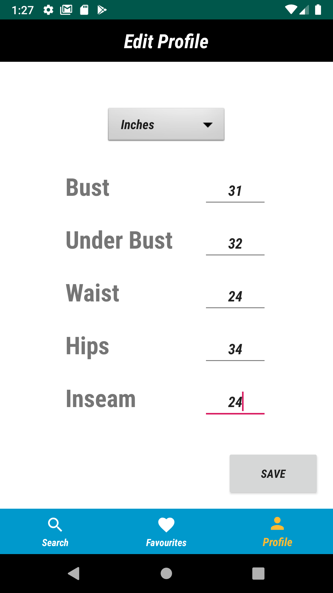
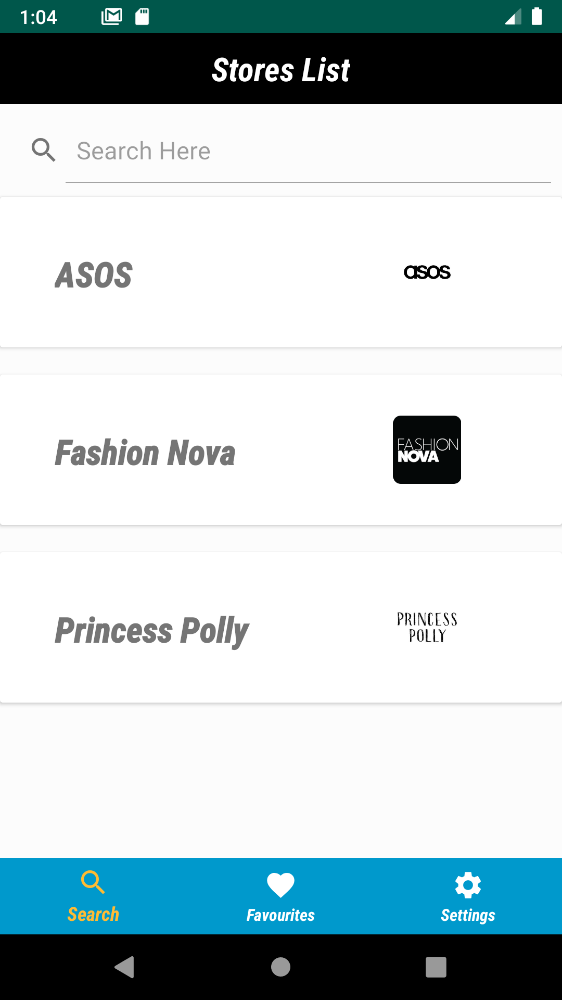
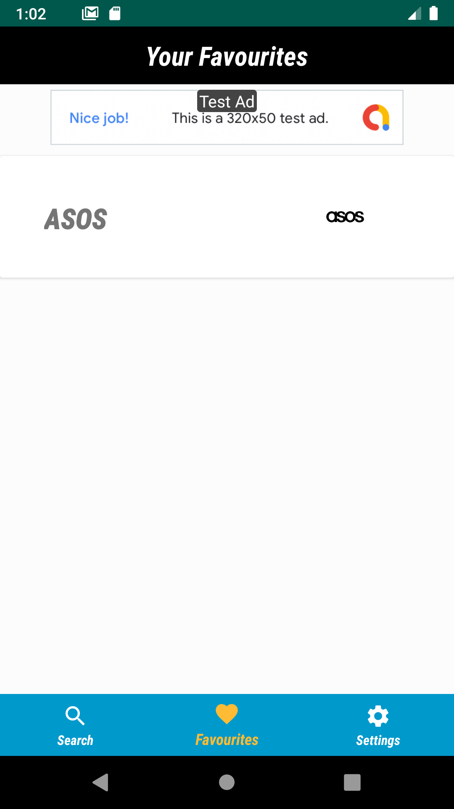
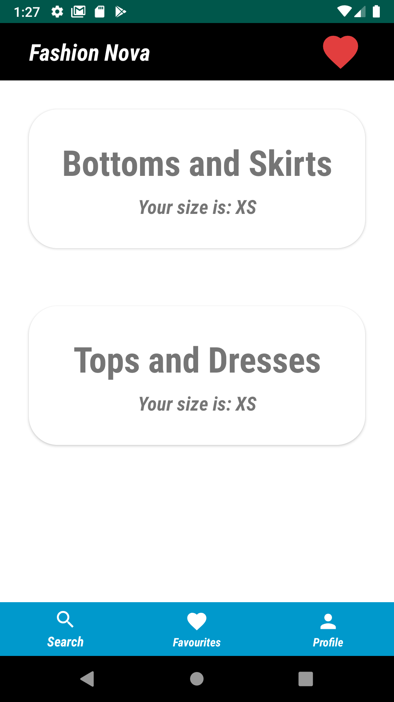
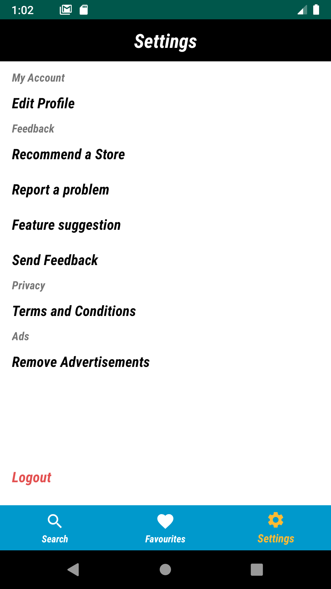
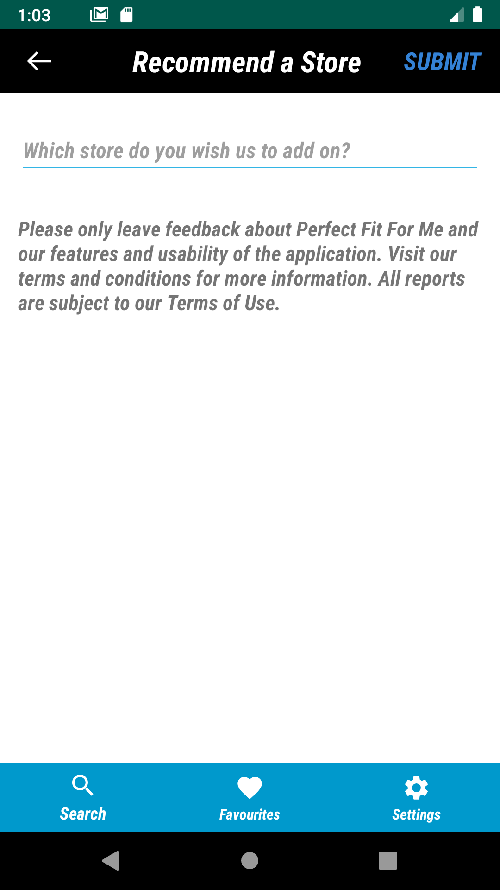

# Clothing App (Without Source Code) - Kelvin Kwok

## Inspiration
One of the main problems when shopping clothes online is finding the right fit for you. For women, dresses can be a pain when finding which dress may or may not fit you. Each store has their own style guide and with this data, I have created an app to discover your size in an efficent manner.

## UI Design
                                 

